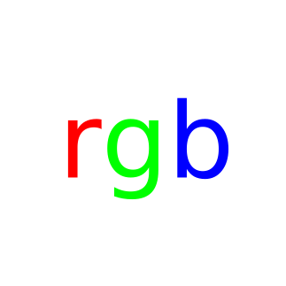

rgb is a color package for Go, it provides color-spaces as subpackages.

**Available Color spaces**

* srgb
* rgba
* cmyk
* ycbcr
* hsl
* hsv
* hcl

* cie/lab
* cie/luv
* cie/xyy
* cie/xyz

**API Documentation**

Each package in the module shares the following API:

```go
    //Model is the color.Model of the specific colorspace.
    var Model color.Model = ...

    //Color is a colorspace specific representation of a color
    type Color struct {...}

    //New takes colorspace specific constructor values
    func New(...) Color {...}

    //From converts a color interface to a Color in the colorspace
    func From(c color.Color) Color {...}

    //RGBA implements color.Color
    func (c Color) RGBA() (r, g, b, a uint32) {...}
```

Where possible the package will expose an integer and hex type of the color:
```go
    //Int is an integer representation of the Color.
    type Int ...

    //Int returns the Color as an Int
    func (c Color) Int() Int {...}

    //RGBA implements color.Color
    func (i Int) RGBA() (r, g, b, a uint32)  {...}

    //Hex is a hex representation of Color.
    type Hex string

    func (h Hex) String() string {...}

    //Hex returns the Color as a Hex
    func (c Color) Hex() Hex {...}

    //RGBA implements color.Color
    func (h Hex) RGBA() (r, g, b, a uint32) {...}
```

Each package may have some colorspace-specific functionality.  
IE. providing methods to access the underlying components.
```go
    package rgb

    //Red returns the underlying red component of the rgb Color.
    func (c Color) Red() uint8 {...}

    //Green returns the underlying green component of the rgb Color.
    func (c Color) Green() uint8 {...}

    ...
```

Additionally, the root rgb package has every named HTML color 
defined as a constant.
```go
    package rgb

    const (
        AliceBlue            Hex = "#F0F8FF"
        AntiqueWhite         Hex = "#FAEBD7"
        ...
    )
```
